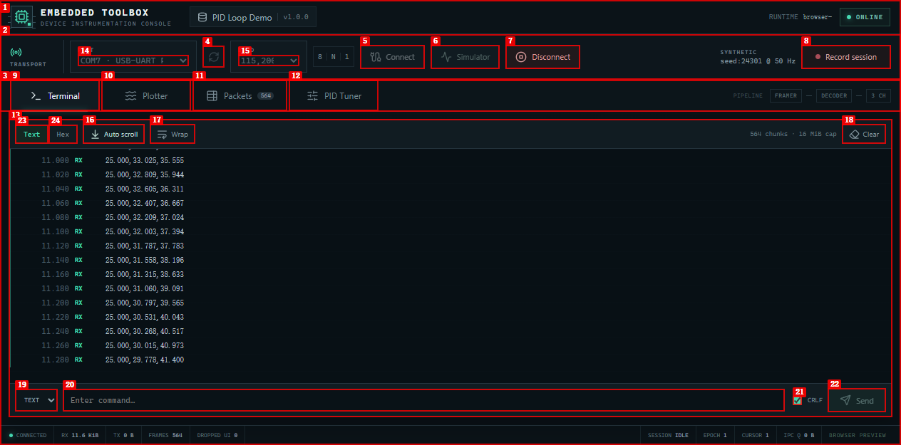

# Embedded Toolbox

Windows-first desktop workbench for debugging, acquisition, protocol analysis, and manual PID tuning of STM32, ESP32, Arduino, and other USB-UART embedded devices.

Built with Tauri 2, Rust, React, TypeScript, uPlot, and SQLite.



## Features

- Serial-port discovery and a Windows V1 product limit of one active serial source. The Rust core is designed around a multi-source `SourceRegistry`.
- Shared acquisition pipeline for Terminal, Plotter, Packets, and PID Tuner, with independently bounded consumer queues.
- Text and hex terminal I/O through a FIFO `TxScheduler`, including deadlines, cancellation, minimum frame intervals, partial-write recording, and TX status events.
- End-delimiter, header/trailer, fixed-length, and length-field framers with maximum-frame limits and resynchronization rules.
- CSV, JSON, and binary decoding; configurable CRC/XOR/SUM checksum ranges; stateful transforms with explicit reset reasons.
- Time-series plotting with typed-array ring buffers and pixel-bucket min/max downsampling.
- SQLite WAL session storage, periodic passive checkpoints, final truncate checkpoints, multi-epoch sessions, replay, and CSV export.
- Versioned binary stream envelopes plus `runtimeInstanceId`, `EventCursor`, and snapshot synchronization for control-plane state.
- Deterministic synthetic transport with disconnect, corruption, gap, duplication, fragmentation, burst, write-failure, and partial-write fault injection.

## Architecture

```text
SourceRuntime
  |- Transport RX
  |- SessionClock
  |- TxScheduler
  |- RecorderQueue -> SQLite
  |- ParserQueue -> Framer -> Decoder -> Transform
  `- DisplayQueue -> Tauri IPC -> React
```

Each downstream consumer owns an independent bounded queue. A slow UI, parser, or recorder cannot silently propagate backpressure into unrelated consumers.

## Stack

- Desktop shell: Tauri 2
- Core: Rust stable
- Frontend: React, TypeScript, Vite, pnpm
- Plotting: uPlot
- Storage: SQLite with WAL mode
- Target platform: Windows 10/11 x64

## Quick start

Prerequisites: Node.js 24, pnpm 10, Rust stable, Visual Studio 2022 C++ Build Tools, and Microsoft Edge WebView2 Runtime.

```powershell
git clone https://github.com/jiazhengfu912-lang/embedded-toolbox.git
cd embedded-toolbox
pnpm install
pnpm tauri dev
```

To preview only the React UI (with built-in synthetic telemetry):

```powershell
pnpm dev
```

## Hardware quick test

1. Connect an STM32, ESP32, or Arduino to a 3.3 V USB-UART adapter.
2. Select the adapter COM port and baud rate in **Transport**.
3. Select **Connect** and verify incoming data in **Terminal**.
4. Open **Plotter** for CSV/JSON samples, **Packets** for framed binary data, or **PID Tuner** to enqueue PID commands.
5. Select **Record session** to save a SQLite `.etdb` session.

The included STM32F103C8T6 telemetry firmware is in [`Test/STM32F103_Telemetry`](Test/STM32F103_Telemetry).

## Verification

```powershell
pnpm test
pnpm typecheck
pnpm build

Push-Location .\src-tauri
cargo test --lib
Pop-Location

pnpm tauri build
```

Hardware verification completed on 2026-08-16 with an STM32F103C8T6 and CH340 USB-UART adapter at 115200 baud:

- Real serial acquisition, Terminal, Plotter, Packets, and basic PID command flow.
- Session recording and final SQLite WAL truncate checkpoint.
- USB-UART unplug/replug during recording: Epoch 1 ended with `TransportFault`; the application automatically created Epoch 2 on the reattached `COM10` device and continued recording.

The following acceptance areas remain pending: 921600-baud 30-minute stress testing, full TX scheduling fault matrix, all framer/checksum variants, replay seek/version rejection, EventCursor reconnect edge cases, UI memory-limit tests, and COM-port-number-change reconnect testing.

## Project layout

```text
src/                         React frontend
src-tauri/src/               Rust core and Tauri IPC
Test/STM32F103_Telemetry/    STM32F103C8T6 telemetry firmware
examples/                    Example .etp projects
docs/ARCHITECTURE.md         Core architecture and data contracts
artifacts/                   UI preview images
```

## Build an installer

```powershell
pnpm tauri build
```

Artifacts are produced under `src-tauri/target/release/bundle/`.

## V1 scope

V1 supports Windows, one active serial source in the product UI, four fixed workspaces, and manual PID tuning. BLE, TCP/UDP, CAN, Modbus, multi-device UI, scripts/plugins, automatic PID tuning, firmware flashing, and cloud features are intentionally out of scope.

## License

No open-source license has been selected yet. All rights are reserved until a license is added.
